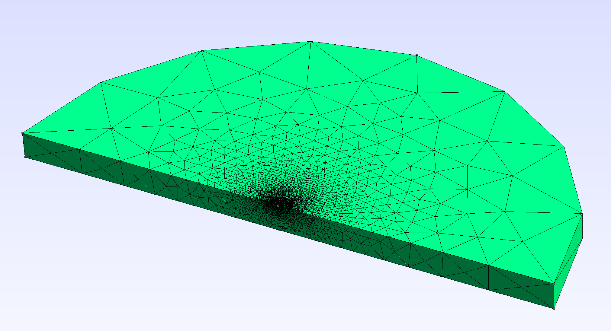
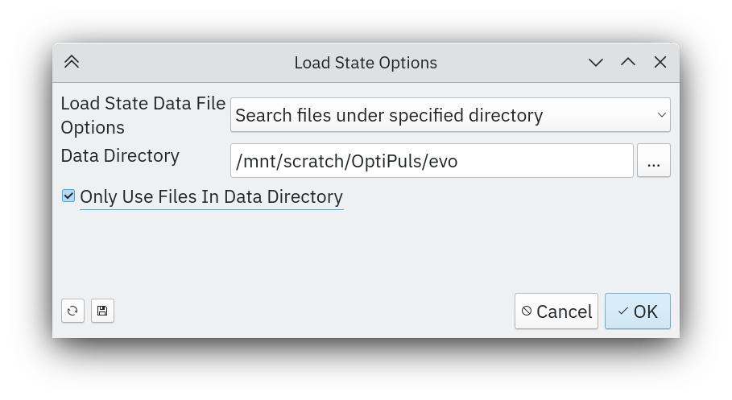
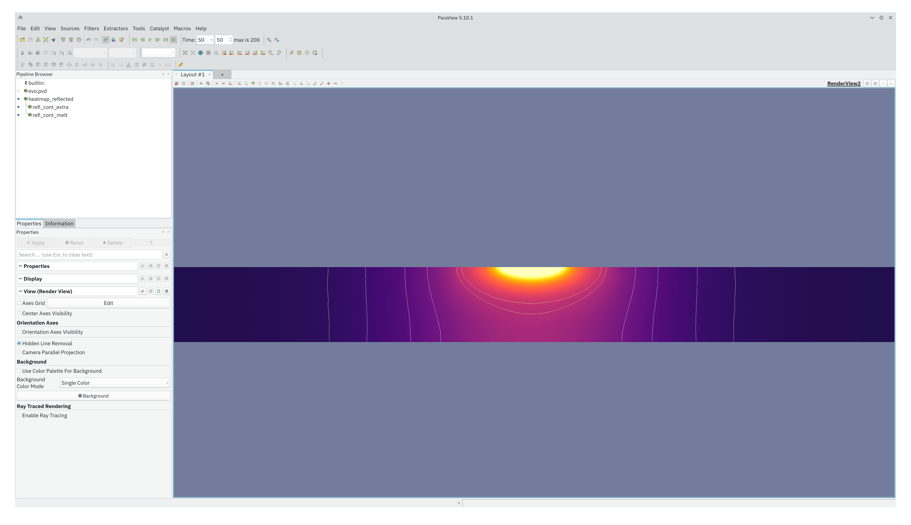
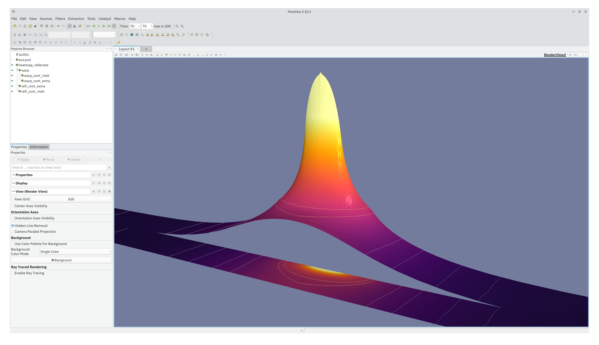
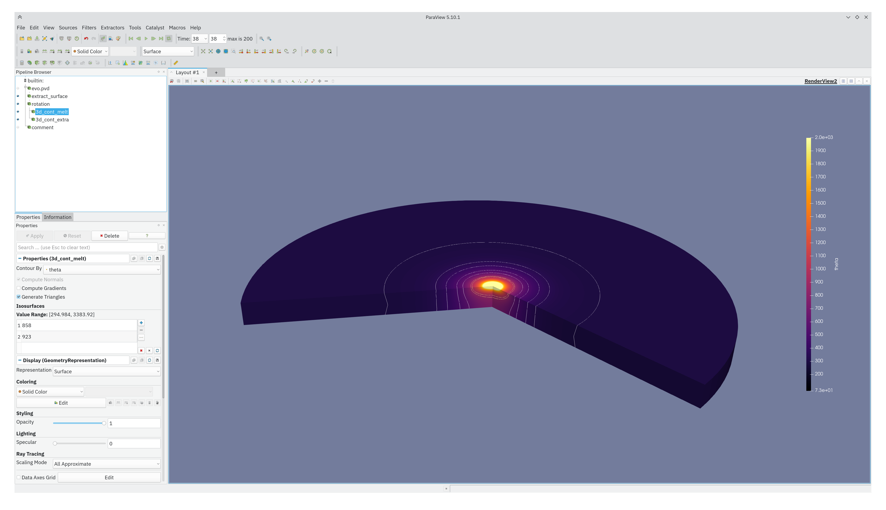
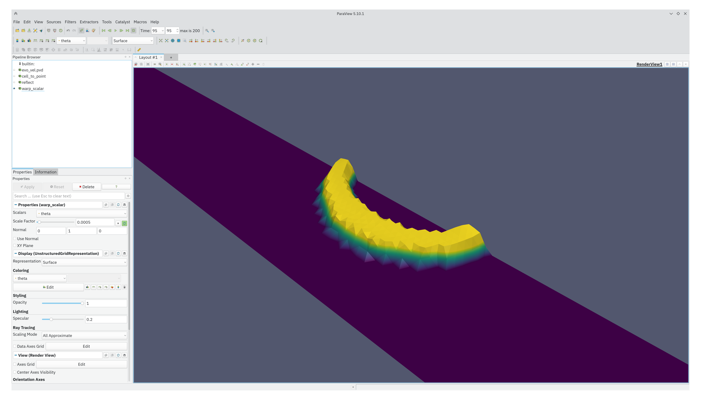
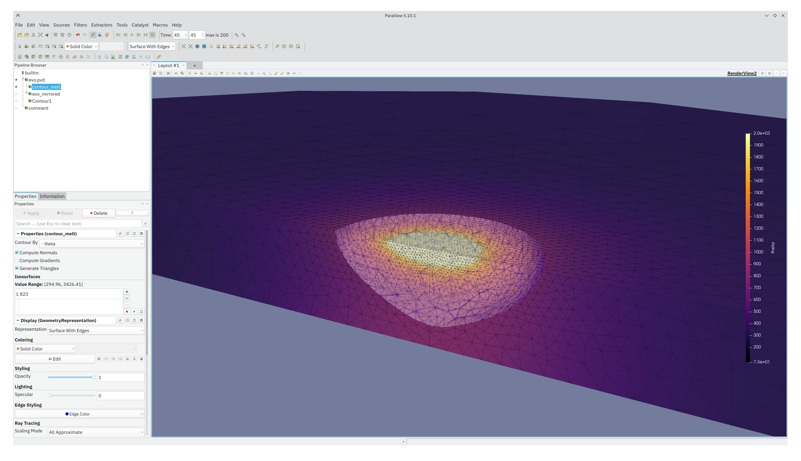

Extras
======

Advanced Mesh Generator
-----------------------

A helper script is provided for generation of advanced problem specific 2d (XZ) and 3d meshes for both the single-spot and the double-spot (multi-spot) problems. Notice that while `Gmsh`_ (an open source 3D finite element mesh generator) and ``pygmsh`` python package are not required for running ``optipuls`` these have to be installed for generation of an advanced custom mesh.

.. _Gmsh: http://gmsh.info/

Generating mesh
^^^^^^^^^^^^^^^

.. code-block::
	:caption: Mesh generation options.

	$ python3 mesh_generate.py --help
	usage: mesh_generate.py [-h] [-Z Z] [-R R] [-r R] [--overlap OVERLAP] [--dim {2,3}] [--lcar_min LCAR_MIN]
	                        [--lcar_max LCAR_MAX] [-o OUTPUT] [-v] [--singlespot]

	options:
	  -h, --help            show this help message and exit
	  -Z Z                  height of the problem domain
	  -R R                  radius of the problem domain
	  -r R                  radius of the laser beam
	  --overlap OVERLAP     overlap of the welding spots for double-spot problem, float in [0, 1]
	  --dim {2,3}           dimension of the mesh
	  --lcar_min LCAR_MIN   minimal resolution of the mesh
	  --lcar_max LCAR_MAX   maxinal resolution of the mesh
	  -o OUTPUT, --output OUTPUT
	  -v, --verbose
	  --singlespot          use this option for single-spot problems (sets overlap to 1)

Examples::

	$ python3 mesh_generate.py --singlespot --dim 3 --output singlespot_XYZ.msh
	$ python3 mesh_generate.py --overlap=.5 --dim 3 --output doublespot_0.5_XYZ.msh
	$ python3 mesh_generate.py --singlespot --dim 2 --output singlespot_XZ.msh

The generated files can be viewed in Gmsh.

	Inspect generated mesh in Gmsh.a

Converting mesh
^^^^^^^^^^^^^^^

In order to be used by FEniCS the mesh should be converted to ``.XDMF`` format.

.. code-block::
	:caption: Mesh convertion options.

	$ python3 mesh_convert.py --help
	usage: mesh_convert.py [-h] [-i INPUT] [-o OUTPUT] [--dim {2,3}]

	options:
	  -h, --help            show this help message and exit
	  -i INPUT, --input INPUT
	  -o OUTPUT, --output OUTPUT
	  --dim {2,3}           dimension of the mesh

Examples::

	$ python3 mesh_convert.py --dim 3 --output singlespot_XYZ.xdmf
	$ python3 mesh_convert.py --dim 2 --output singlespot_XZ.xdmf

.. _paraview-helpers:
ParaView Helpers
----------------

`ParaView`_ is an open-source, multi-platform data analysis and visualization application. In OptiPuls it is used to inspect the output of the numerical simulation of the laser welding.

.. _ParaView: https://www.paraview.org/

ParaView State Files
^^^^^^^^^^^^^^^^^^^^

In order to make the visualization more convenient, a set of preconfigured ParaView `state files <https://www.paraview.org/Wiki/Advanced_State_Management>`_ is provided.

	Load state file and specify the simulation output directory.

	Sectional view for a 2d problem.

	Warp view for a 2d problem.

	3d (rotated) view for a 2d problem.

	Solidification front velocity warp view for a 2d problem.

	Wireframe view for a true 3d problem.

Render Animation
^^^^^^^^^^^^^^^^

A helper script ``paraview_save_animation.py`` is provided in order to generate an animation for a given state file. Its output is a set of ``.PNG`` files. These files can be converted to a video using ``ffmpeg``.

Example::

	ffmpeg -r 60 -f image2 -s 3840x2160 -i /tmp/paraview/ani.%04d.png -vcodec libx264 -pix_fmt yuv420p -crf 17 output.mp4
