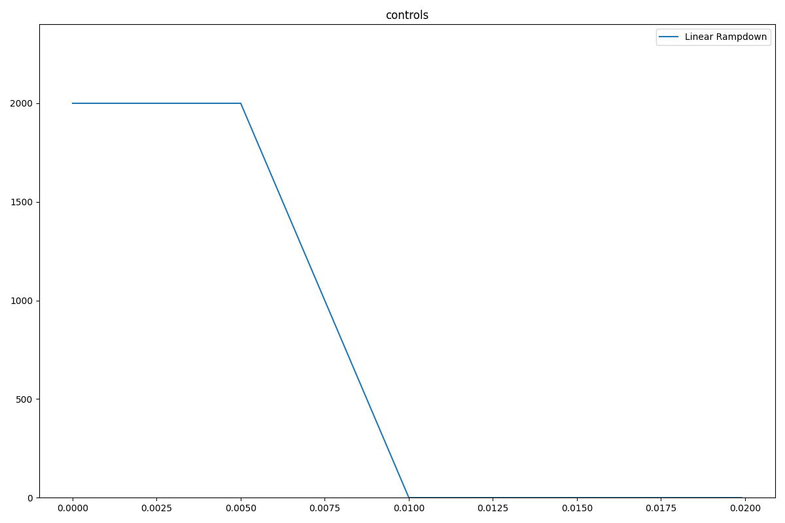
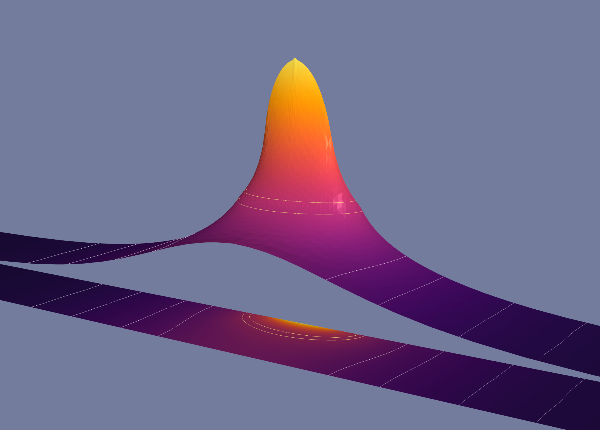
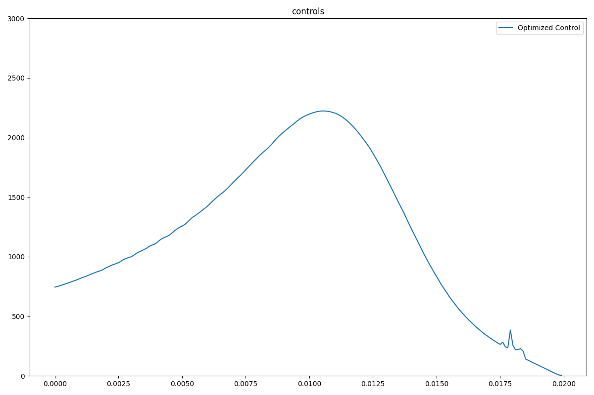

Quick Start
===========

The easiest way to start with ``optipuls`` is by running and modifying some of the built-in examples.

Preliminaries
-------------

.. note::

   This guide assumes that a Linux system is used. Docker software can be also run on Windows, however this use case was not tested and therefore is not recommended.

It is recommended to create a separate directory on the host system for the output of numerical simulations and optimizations. In this guide it will be ``/data/OptiPuls/output``.

.. code-block::

	$ mkdir -p /data/OptiPuls/output # creating a directory for the numerical artifacts

The following command will run ``optipuls`` docker container in interactive mode::

	$ mkdir /tmp/scratch
	$ docker run -it \
		--volume $(pwd):/home/fenics/shared \
		--volume /tmp/scratch:/scratch \
		--user $UID \
		optipulsproject/optipuls:latest

	fenics@fc203ef7c5b2:~/shared$

The changed command line prompt indicates that the commands will be now run inside the newly created container. To detach and stop the container type ``exit`` or press `Ctrl-D`.

Linear Rampdown Simulation
^^^^^^^^^^^^^^^^^^^^^^^^^^

Perform the following steps to run a simple built-in numerical simulation for a linear rampdown laser pulse shape.

Inside the container open the directory ``python-optipuls`` source code and run ``examples/simulation_linear_rampdown.py``::

	fenics@fc203ef7c5b2:~/shared$ cd /home/fenics/src/python-optipuls/
	fenics@fc203ef7c5b2:~/shared$ python3 examples/simulation_linear_rampdown.py --scratch /scratch/simulation_linear_rampdown/

The resulting files will be in ``/data/OptiPuls/output``. Use ParaView (see :ref:`paraview-helpers`.) to inspect the simulation.

In order to modify this simple example make a copy of the file ``simulation_linear_rampdown.py`` and follow the comments in the file to adjust the problem formulation. For example, to change the total pulse duration and the rampdown pulse shape one needs to modify the following lines::

	...
	# initialize the time domain
	time_domain = TimeDomain(0.020, 200)
	...
	# create a simulation with linear rampdown pulse shape
	control = linear_rampdown(time_domain.timeline, t1=0.005, t2=0.010)
	...

Zeroguess Optimization
^^^^^^^^^^^^^^^^^^^^^^

In a similar way toy the previous example, perform the following steps to run a simple built-in numerical optimization with zero pulse shape as an initial guess. The optimizer will be increasing the laser power untill the desired depth of the weld will be achieved.

In a similar way toy the previous example, start the container, open the directory ``python-optipuls`` source code and run ``examples/optimization_zeroguess.py``::

	fenics@fc203ef7c5b2:~/shared$ cd /home/fenics/src/python-optipuls/
	fenics@fc203ef7c5b2:~/shared$ python3 examples/optimization_zeroguess --scratch /scratch/optimization_zeroguess/

One can play around and modify the optimization parameters::

	# optimization parameters
	problem.beta_control = 10**2
	problem.beta_velocity = 10**18
	problem.velocity_max = 0.15
	problem.beta_liquidity = 10**12
	problem.beta_welding = 10**-2
	problem.threshold_temp = 1000.
	problem.target_point = dolfin.Point(0, 0, -.7 * space_domain.Z)
	problem.pow_ = 20

The impact of these parameters on the produced optimized pulse shapes is explained in the paper :doc:`optimal-control-single-spot`.
